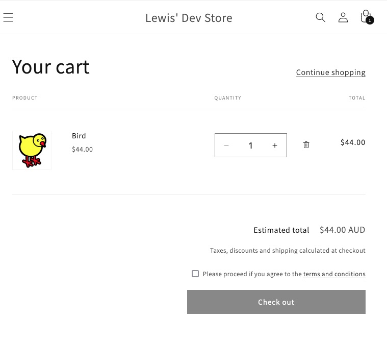

#### TL;DR

Create a new policy in your shopify store (e.g., `https://yourshopurl/policies/terms-of-service`) then copy and paste the [below code](#the-code) into your shop's `main-cart-footer.liquid` file. Insert the code just above the closing `</small>` tag.

#### Introduction

Some products or services involve certain legal agreements, additional risks, or specific customer commitments, therefore there are times when a Agree to Terms and Conditions checkbox is required prior to checkout.  

If you're in that situation, read on.

#### What we're creating

Here is an example of what we're creating.



#### Step-By-Step

##### 1. Create a policy

From your store's admin page, from settings navigate to policies.  There, you can fill in the appropriate policy.  Make sure that you take note of the url - or more specifically the part of the url that comes after your shop name (e.g., /policies/terms-of-service)

##### 2. Navigate to the `main-cart-footer.liquid` file

Next, you'll want to be able to navigate to your code editor and search for the file, `main-cart-footer.liquid`. Once, you've got that open then search for `</small>` and paste the below code above it.

##### 3. Tailor the code as required

Now, all you need to do is tweak the code to suit your specific need. That is, change the `/policies/terms-of-service` part so that it reflects the path to the policy you created. You can also alter the Please proceed if you agree to the... text to something more appropriate for your particular use case.

#### The Code

```html
<div id="lewis-terms-wrapper">
    <label for="lewis-checkbox"/>
        <input type="checkbox" id="lewis-checkbox" name="checkbox" value="true"/>
        Please proceed if you agree to the <a href={{shop.url | append: "/policies/terms-of-service"}}>terms and conditions</a>
    </label>
</div>
```
This is some HTML with a bit of Liquid mixed in.  The key part of the above is the name of our policy.  Spaces are replaced with hyphens (and it is lower case).  So if we're altering the **Terms of Service** policy then the path that we're appending to our `shop.url` will be `policies/terms-of-service`.  

```CSS
<style>
#lewis-terms-wrapper {
    display: block;
    margin-top: 2em;
    margin-bottom: 1em;
}
</style>
```
The above CSS adds some styling.

```JavaScript
<script>
    document.addEventListener('DOMContentLoaded', () => {
        const checkbox = document.getElementById('lewis-checkbox');
        const button = document.getElementById('checkout')
        checkbox.addEventListener('change', () => {
            button.disabled = !checkbox.checked
        })

    })
</script>
```
The above adds an event listener to our checkbox so that whenever its value changes we toggle the checkout button.  This means that when the checkbox is not checked, then the checkout button is disabled (i.e., greyed out).

#### Summary

Today we've added a Terms-and-Conditions checkbox to your Shopify store cart page, that won't let users proceed unless it they are agreed upon.  If you would like to connect or require specific assistance with a coding project, please get in touch.
