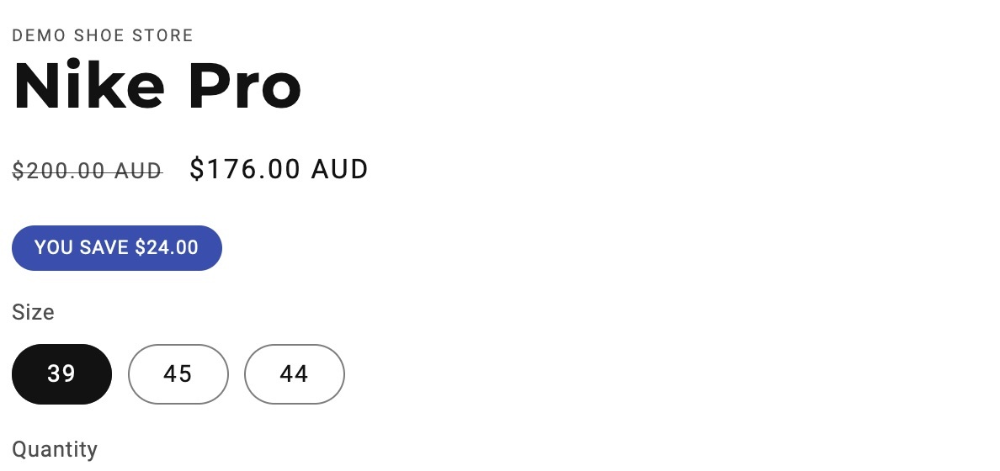
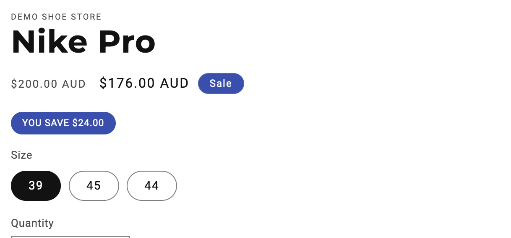

#### TL;DR
Here we change how 'Sale' information is presented on the product page.  Simply create a liquid block on your product page and insert [this code](#the-code).

#### Introduction
You may be looking to emphasise the amount of money that your potential customer can save, like the example below.  This can be achieved quite easily using a Custom Liquid block.



#### Step-by-Step
##### 1. Add the custom liquid block.
First you'll want to navigate to your product page, if you haven't done so already.  Once there, click 'add block' (on the left-hand-side) and insert the 'Custom Liquid' block.  

##### 2. Paste the code below.
Paste the code [below](#the-code) into the Custom Liquid block and click save.

#### The Code

```Liquid

<div class="savings-tag" > YOU SAVE {{ product.compare_at_price | minus: product.price | money }}
</div>
{{section.settings.colors }}

<style> 
.savings-tag {
background-color: rgb(51, 79, 180);
display: inline-block;
padding: 0.3em 1.2em;
border-radius: 20px;
margin: 0;
font-size: .75em;
color: white;
}
</style>
```

The above code first checks whether the compare_at_price price exists, which means that the sale badge will be present, and if so it inserts the liquid saving logic.  Following, that there is some styling.

Some key styling elements that you may want to adjust is the background-color and the font-size.  Feel free to experiment.  The `border-radius` property rounds the edges of the tag, with 0 meaning square edges.

This is what it currently looks like:



#### Remove the Sale tag
If you nagivate into your code editor and into the main-product.liquid file, you'll find the below liquid code.

```liquid
    
        <div class="no-js-hidden" id="price-{{ section.id }}" role="status" {{ block.shopify_attributes }}>
        
        </div>
```

Simply replace the `show_badges: true` line with `show_badges: false`.  And the final product will look like this:


#### Further help
Please feel to reach out if you need help or assistance, or you just have any questions.


<pre></pre>

